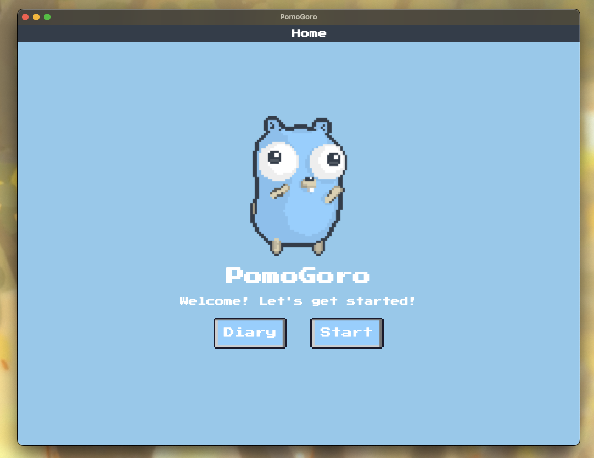

# README

## About PomoGoro

This is a simple Pomodoro app written mostly in React, using Wails.

I initially intended for this to be mostly in Go - but doing the front-end was very intuitive
with React using this framework. Is this really a PomoGoro, then?

Not sure, so my next mission is creating the same, but using Fyne.

## Live Development

To run in live development mode, run `wails dev` in the project directory. This will run a Vite development
server that will provide very fast hot reload of your frontend changes. If you want to develop in a browser
and have access to your Go methods, there is also a dev server that runs on http://localhost:34115. Connect
to this in your browser, and you can call your Go code from devtools.

## Building

To build a redistributable, production mode package, use `wails build`.
